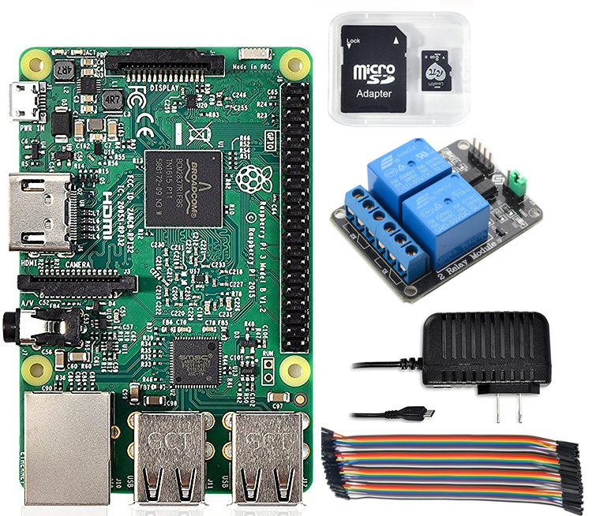
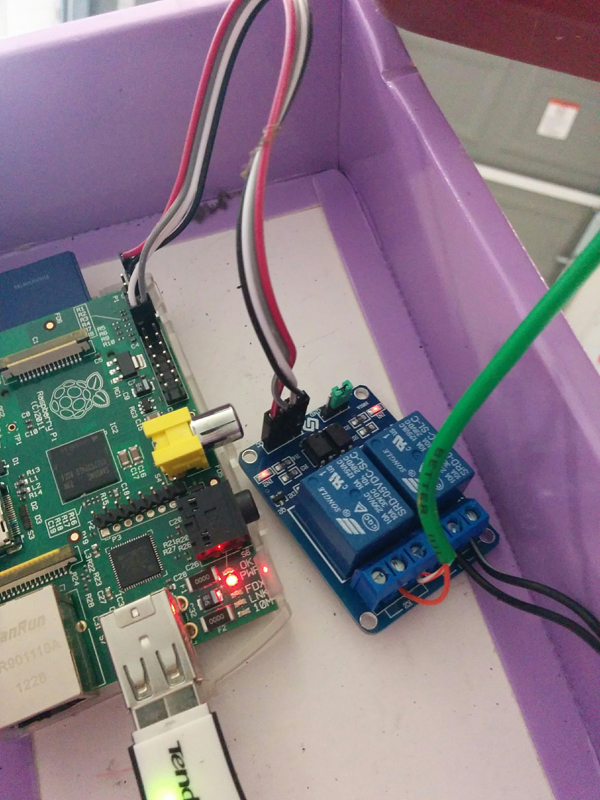

About 5 years ago, [I wrote about a solution](/iphone-control-house-alarm-and-garage-doors/) I had for controlling my garage doors from my phone. It was a fun project and generally has been working well. However, the triggering mechanism relies upon X10 through my Honeywell Vista 20-P alarm panel and is therefore not very transferable to others wanting to do a similar project. When friends ask about it and the possibility of doing their own similar project, I always have to hestitate a bit and say "well, it's a pretty specific setup to my house and equipment". I really have wanted to say "sure, here's a blog post showing you each step so you can do a project for yourself".

I've been having more issues with X10 interference lately and decided to dust off one of my Raspberry Pi devices and put it to use as an alternative solution that should surely be more reliable and a fun project along the way!

As a precursor to this project, I was playing around with the GPIO pins and my multimeter to see if I could control them with the [Node rpio library](https://github.com/jperkin/node-rpio) and posted about it on Twitter.

<blockquote class="twitter-tweet" data-lang="en"><p lang="en" dir="ltr">I&#39;m totally geeking out over here with using JavaScript to apply 3V to my RaspberryPi GPIO pins: <a href="https://t.co/CfYiDLYFCB">https://t.co/CfYiDLYFCB</a></p>&mdash; Brady Holt (@bradymholt) <a href="https://twitter.com/bradymholt/status/809021240329564160">December 14, 2016</a></blockquote>
<script async src="//platform.twitter.com/widgets.js" charset="utf-8"></script>

Once I was able to get this working, I knew getting the Pi hooked up to a relay and then triggering my garage door openers would be easy.

## Parts List

Let's get started. Here's what you'll need:

* [Raspberry Pi 3 Starter Kit](https://www.amazon.com/LoveRPi-Raspberry-Plug-Play-Starter/dp/B01IYBZEV6) (includes power adapter and 8GB SD Card)
* [2 Channel DC 5V Relay Module](https://www.amazon.com/gp/product/B00E0NTPP4)
* [Female to Female Jumper Wires](https://www.amazon.com/gp/product/B017NEGTXC)



## Hardware Setup

Using 4 Female to Female jumper wires, connect the Raspberry Pi to the relay:

| RPi Pin         | Relay Pin |
| --------------- | --------- |
| Pin 6 (Ground)  | GND       |
| Pin 11 (GPIO 0) | IN1       |
| Pin 12 (GPIO 1) | IN2       |
| Pin 2 (5V)      | VCC       |

<a href="raspberry-pi-3-pin-connections-relay.png" target="_blank">

## Software Setup

Now that the relay is connected to the pins, it's time to setup the OS and software we will use to control the relays.

[Arch Linux ARM](https://archlinuxarm.org/) will be used as the OS and the [raspberrypi-relay-controller](https://github.com/bradymholt/raspberrypi-relay-controller) project will be used to provision the Pi with Ansible and install all necessary software. This will make setting up the Raspberry Pi software very straightforward. Rather than rehashing all the raspberrypi-relay-controller instructions here, simply follow the [README](https://github.com/bradymholt/raspberrypi-relay-controller/blob/master/README.md) step-by-step. In short, you will doing the following:

1. Install Arch Linux ARM on SD card and then booting the Raspberry Pi
2. Setup up key-based authentication for root user
3. Run Ansible playbook to provision all necessary software and configuration

Once you are done with the instructions, you should be able to open http://[raspberry_ip_address]:3000 in a browser and see the following simple web interface that allows triggering of the relays.


Although there are several components at play, the actual control of the relay is handled by a [Node.js process](https://github.com/bradymholt/raspberrypi-relay-controller/blob/master/roles/relay-rest-api/templates/server.js.j2) that utilizies [rpio](https://github.com/jperkin/node-rpio) to trigger the relay temporarily using this block of code:

```js
function toggleGpioPinOn(pin, durationMilliseconds) {
  // Set the initial state to low.
  rpio.open(pin, rpio.OUTPUT, rpio.LOW);
  // Turn pin ON.
  rpio.write(pin, rpio.HIGH);
  // Wait durationMilliseconds
  rpio.msleep(durationMilliseconds);
  // Turn pin OFF.
  rpio.write(pin, rpio.LOW);
}
```

## Conection to Garage Door Openers

1. Run `sudo shutdown` and then unplug the Pi
2. Connect 2 wires from each garage door opener switch contacts to the relay. The switch contacts are usually labeled White and Black and will be the same ones your wall switch(es) are attached to.
3. Plug back in the Pi and let it boot

<a href="relay_to_garage_door_connection.png" target="_blank">

Here is what my Pi looks like all connected up:



## Test

1. Open http://[ip_address]:3000/ and click the "Relay 1" button. The garage door should open! Press it again and the door should close!

Here's a video showing the final setup:

<iframe width="560" height="315" src="https://www.youtube.com/embed/yMMDJPVJ0d4" frameborder="0" allowfullscreen></iframe>

## Going Further

1. Get a [project box like this one](https://www.amazon.com/dp/B0002BBQUU) and enclose everything nicely.
2. Fork [raspberrypi-relay-controller](https://github.com/bradymholt/raspberrypi-relay-controller) and customize the web interface, such as [changing the button labels](https://github.com/bradymholt/raspberrypi-relay-controller/blob/master/roles/relay-rest-api/templates/index.html#L41-L42). Then, simply run `./provision.sh` again to push out the updates.
3. Integrate with another system utilizing the [simple REST API](https://github.com/bradymholt/raspberrypi-relay-controller/blob/master/roles/relay-rest-api/templates/server.js.j2#L39-L40).
4. Get a [magnetic contact switch like this](https://www.amazon.com/Honeywell-951WG-WH-Recessed-Magnetic-Contact/dp/B001UKY1A4) and use [rpio](https://github.com/jperkin/node-rpio) to detect if the door is open or closed.
