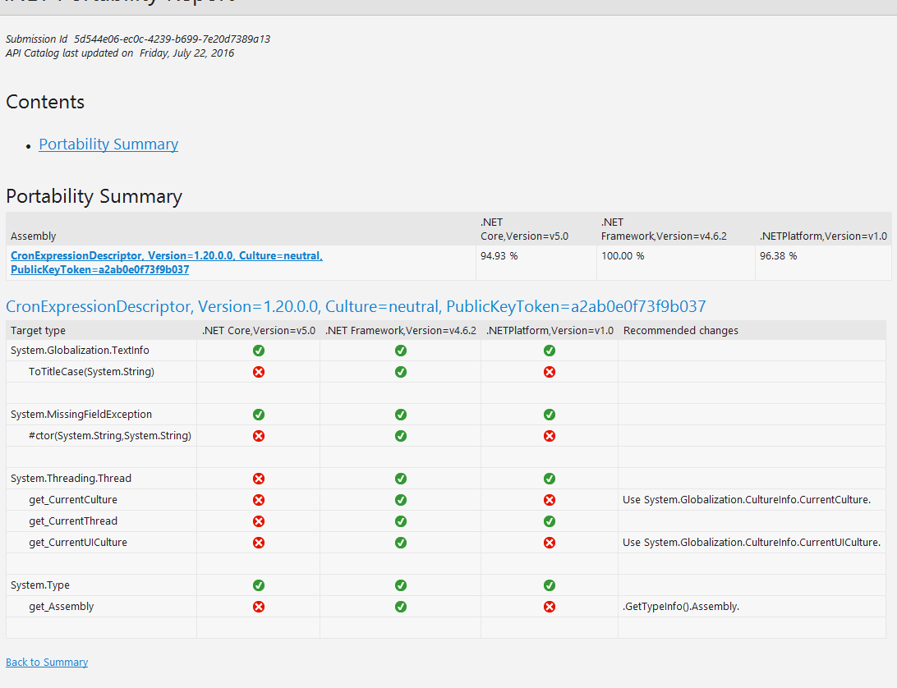
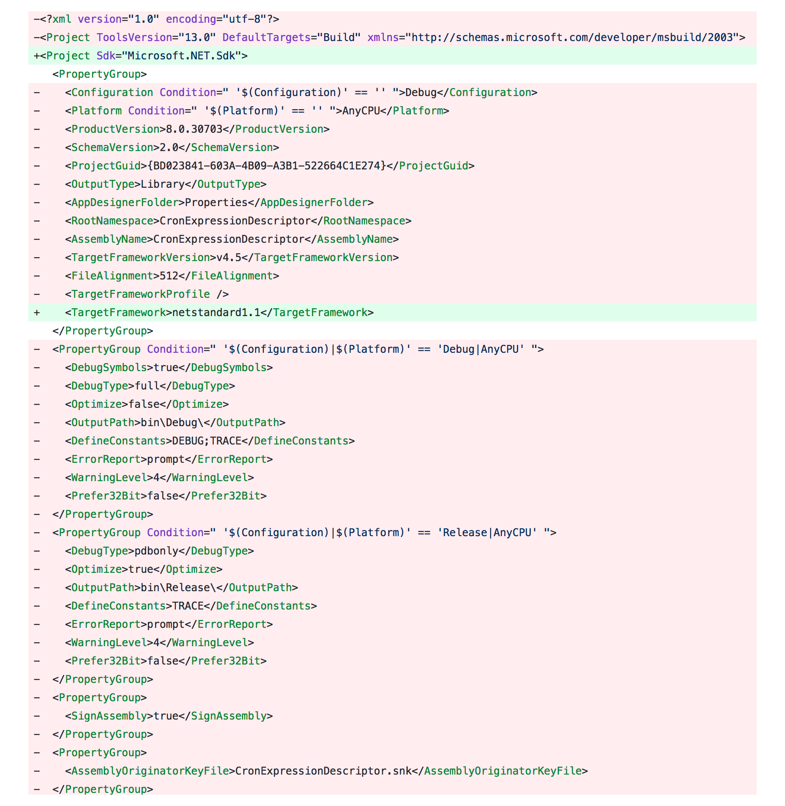

Last year, an [issue was opened](https://github.com/bradymholt/cron-expression-descriptor/issues/65) on my [cron-expression-descriptor](https://github.com/bradymholt/cron-expression-descriptor) project asking about support for .NET Core.  It took me a year to finally get it done (mostly because of laziness) and I would like to share the process of porting it.

## Getting Standard

Searching around for "how to port a .NET Framework library to .NET Core" turned up some results but most of the articles were long and I didn't really understand the _big picture_ of the process.  I didn't understand, for example, what the end result would be.  I had questions like:

- Will I end up with two assemblies, one for .NET Framework and one for .NET Core which will be packaged together in a single NuGet package?
- Will I need need to create an entirely separate NuGet package for .NET Core that will stand alone?
- If I am able to build a single assembly that will work on .NET Framework or .NET Core, will I have to use compile flags for features not supported in .NET Core yet?
- Since .NET Core uses project.json file, will I need one of those and also a .csproj for .NET Framework?  So, I'll need two project files for my library?

You can see some of this confusion in one of the [comments I posted on the issue](https://github.com/bradymholt/cron-expression-descriptor/issues/65#issuecomment-237626977). Most of the articles didn't address these questions, at least not the ones I referenced.  I saw lots of things about running the [The .NET Portability Analyzer](https://docs.microsoft.com/en-us/dotnet/standard/portability-analyzer) to see what things would need to be changed to enable a library to on on .NET Core and the process of switching out unsupported features with alternatives.

## Portability Analyzer
So, I started with the The .NET Portability Analyzer and found that I was in fairly good shape, mostly thanks to the fact that Cron Expression Descriptor doesn't have any external depedencies.  There were minor things like `ToTitleCase` that wouldn't work on .NET Core but the big on was the absense of `System.Threading.Thread.CurrentCulture`.  This was being used to determine the i18n setting to use at runtime, which affects the language of the output.  Ok, I realized I'm probably going to need to rip most of that out and just allow the culture settings to be specified as runtime options.

## Initial Work

I opened a [Pull Request](https://github.com/bradymholt/cron-expression-descriptor/pull/66) with the intial work to get the Portability Analyzer happy and green.  And then, I **did nothing for a year**.  A full year I let this PR sit around.  Why?  I lost some momentium of interest but I also bumped into my original questions and still didn't know the answers.  I thought, "Ok, I've got the Portability Analyzer" happy but now what"?  My library is .NET Core compatiable but what about all the other stuff?  Do I need to just install .NET Core, change some values in the .csproj, build it and then ship it?  How do I know it will continue to work on earlier .NET Framework versions like 3.5?

## .NET Standard

Fortunately, in the year that had past, things got better.  The articles online were better and _most importantly_, [.NET Standard was announced](https://blogs.msdn.microsoft.com/dotnet/2016/09/26/introducing-net-standard/).  This was really the missing piece that made things much clearer for me.  "Oh!  Ok, so I can just tell my library to target .NET Standard, build it, and then it will run on any platform that supports the .NET Standard version I targeted.  That makes sense.".  Now, I was starting to understand the big picture.

## Making Progress

Eventually, I installed [Visual Studio Community 2017](https://www.visualstudio.com/downloads/), which had tooling for .NET Standard, and created a brand new C# library project using the .NET Core starter templates.  I wrote up a quick "Hello World" .NET Standard library and then referenced it from a .NET Framework console app.  Once I got this working, I knew I was moving in the right direction.  I then created a .NET Core console app (from the starter templates of course) and referenced that same library and confirmed it worked.  Cool, so now I've got a .NET Standard library that can be consumed from a .NET Framework and .NET Core application.

I opened on the .csproj for my "Hello World" .NET Standard library to see where the magic was.  To my surprise, it was super simple.  _Much_ more condenced than what I am used to seeing in a .csproj file.  I figured out what I need to change in the CronExpressionDescriptor.csproj project file and ended up with [this](https://github.com/bradymholt/cron-expression-descriptor/pull/66/commits/3115c7858b1f323df510dd204c95529b93c93899#diff-86061dc6e522408b7744126576100654).

The above screenshot isn't even the entire diff.  It's [twice as long](https://github.com/bradymholt/cron-expression-descriptor/pull/66/commits/3115c7858b1f323df510dd204c95529b93c93899#diff-86061dc6e522408b7744126576100654) as that.  Crazy!  Some of the key chages were:

- The Project tag `<Project ToolsVersion="13.0" DefaultTargets...` needed to be changed simply to `<Project Sdk="Microsoft.NET.Sdk">`.
- `<TargetFrameworkVersion/>` changed to `<TargetFramework/>`
- Remove all the `<Compile Include=...` statements referencing all the project files.  The new csproj format includes files in the directory by default.  This is a major improvement!

Once I made the changes and the library built, I knew it was smooth sailing from here.  I just needed to build it, package it and push it up to NuGet.  As I was doing this, I ran into some issues with getting NUnit tests to work and eventually [swapped out NUnit for xUnit](https://github.com/bradymholt/cron-expression-descriptor/pull/66/commits/c13165a8994bc5d463ddbef1322e9680ea7e1501) which has better .NET Core / .NET Standard support.

## Moving to VSCode on macOS

I've used macOS as my primary OS for a several years now and am quite comfortable there.  I feel right at home using VSCode and only booting my Windows 10 VitualBox machine when I have to.  This includes when I need to do work on Cron Expression Descriptor.  I wanted to move over completely to macOS for development moving forward.  So, after some fiddling and Googling, I got everything (build, tests, publishing to NuGet) running on from macOS.  This was huge!  .NET is truly cross-platform!  Now, moving forward, I never have to boot my Windows 10 box to work on this library.  In the [commit history](https://github.com/bradymholt/cron-expression-descriptor/pull/66/commits) you'll see commits related to this switch, namely VSCode tasks setup.

If you look at my [RELEASING.md](https://github.com/bradymholt/cron-expression-descriptor/blob/master/RELEASING.md) doc, you'll see that as long as you have .NET Core SDK installed (on Windows _or_ macOS _or_ Linux) and bash (via Linux Subsystem on Windows), you can run `./build/release.sh` to run the tests, build the assembly and push up a new package to NuGet.

## The Big Picture

At the beginning of this process, I didn't understand the big picture.  Now I do, obviously.  The big picutre with porting a .NET Framework library to .NET Core is this:

> If your library targets a version of .NET Standard, it can be referenced and used from an application running on a .NET platform that suports that version of .NET Standard
