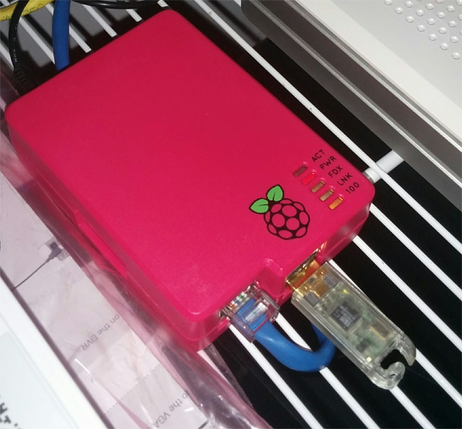

A few years back, I bought a <a href="/my-pogoplug-geek-toy/">Pogoplug</a> and got <a href="https://archlinuxarm.org/">Arch Linux ARM</a> running on it.  It was a lot of fun to work on and I eventually got it configured as a Samba file server, DLNA media server, and running my <a href="/vistaicm-server">vistaicm-server</a> project to control my Honeywell Alarm System.  It was suprisingly stable and I learned to love Arch Linux while fiddling with it.

Last week, it finally hard crashed.  It simply will not turn on anymore and I suspect it has something to do with the power supply on it.  Rather than trying to get it working again, I decided to just replace it with one of the Raspberry Pi devices I had laying around.  After all, I've been looking for a good use for one of them.  Also, getting Arch Linux ARM actually running on the Pogoplug was a bit of a chore and hard to diagnose when there was a low level boot issue because there is no display adapter.  On the other hand, getting Arch running on the Pi and hooking it up to a display via its HDMI port when needing to diagnose a boot problem is trival.

When I initially setup the the Pogo, I did it manually and over time.  You know, I would decide one day, "Hey, I want to setup minidlna on it so I can stream my movies to my TV".  So, I would setup and configure minidlna.  Then, later, I would decide to install transmission as a BitTorrent client and would do the necessary config at that time.  This made for a lot of manual provisioning logic that was not backed up and hard to remember.  There were a few times over the last few years that I completely rebuilt it from scratch, for various, reasons, and it took quite awhile to get it back to its previous state.  I would have to find backups of config files (if I was lucky), remember what I had installed, and fiddle with it to get it just so.

This time, however, I was going to use <a href="https://www.ansible.com/">Ansible</a> to automate the provisioning!  I've been using Ansible more and more and find it suitable for project large _and_ small.  It's really nice to have the entire provisioning process scripted and in source control knowing that if the Pi crashed or I needed to rebuild it for any reason, I could be back up and running in a matter of minutes.

The end result is located in this GitHub repository: [https://github.com/bradymholt/tiger-provisioning](https://github.com/bradymholt/tiger-provisioning).

Currently, the provisioning script does the following:

- Removes the default `alarm` user
- Creates a user account with authorized_keys configured to allow key auth for SSH
- Sets timezone to America/Chicago
- Installs Node.js, samba, minidlna, and [insync](https://www.insynchq.com/)
- Installs some user utilties such as vim, htop, and unzip
- Installs and configures [vistaicm-server](https://github.com/bradymholt/vistaicm-server) so I can control my alarm system
- Configures external USB thumb-drive as destination for Google Drive sync via insync
- Configures samba to allow anonymous share access to media folder
- Configures minidlna to serve videos from the media folder

Thanks to `ansible-vault`, all my provisioning _secrets_ (you know, credentials, keys, and such) are [stored in an encrpyted file](https://github.com/bradymholt/tiger-provisioning/blob/master/secrets.yml) so that I don't have to keep them in a separate location, and remember where they are.  To rebuild this server, I just need to clone the repo, provide the vault password and run the Ansible playbook and I'm good to go.

Here is what my Raspberry Pi looks like, sitting on a shelf in my closet, drawing only about 1W of power.

